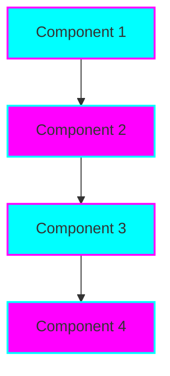

# windows-dev-setup

<div align="center">


**Enterprise-grade solution: windows-dev-setup**

*Professional • Scalable • Mission-Driven*

[](https://tiation.github.io/windows-dev-setup)
[](https://tiation.github.io/windows-dev-setup)
[](https://tiation.github.io/windows-dev-setup/architecture)
[](https://github.com/tiation/windows-dev-setup)
[](https://github.com/tiation/windows-dev-setup/blob/main/LICENSE)

</div>

## 🚀 Overview

Enterprise-grade solution: windows-dev-setup

### ✨ Key Features

- 🎯 **Feature 1** - Description 1
- 🔧 **Feature 2** - Description 2
- 🌟 **Feature 3** - Description 3
- 🛡️ **Feature 4** - Description 4

---

## 🏗️ Architecture


### System Components



### Technology Stack

- **Frontend**: Modern Frontend
- **Backend**: Scalable Backend
- **Database**: Database
- **Infrastructure**: Infrastructure

---

## 📋 Table of Contents

- [Features](#-features)
- [Quick Start](#-quick-start)
- [Installation](#-installation)
- [Usage](#-usage)
- [Documentation](#-documentation)
- [Screenshots](#-screenshots)
- [FAQ](#-faq)
- [Contributing](#-contributing)
- [Support](#-support)
- [License](#-license)
- [About Tiation](#-about-tiation)

---

## ✨ Features

{{FEATURES_LIST}}

---

## 🏃‍♂️ Quick Start

```bash
# Clone the repository
git clone https://github.com/tiation/windows-dev-setup.git
cd windows-dev-setup

# Install dependencies
{{INSTALL_COMMANDS}}

# Run the application
{{RUN_COMMANDS}}
```

---

## 📦 Installation

### Prerequisites

{{PREREQUISITES}}

### Installation Steps

1. **Clone the repository**
   ```bash
   git clone https://github.com/tiation/windows-dev-setup.git
   cd windows-dev-setup
   ```

2. **Install dependencies**
   ```bash
   {{DETAILED_INSTALL_COMMANDS}}
   ```

3. **Configuration**
   ```bash
   {{CONFIG_COMMANDS}}
   ```

---

## 🎯 Usage

### Basic Usage

{{BASIC_USAGE}}

### Advanced Usage

{{ADVANCED_USAGE}}

### Examples

{{USAGE_EXAMPLES}}

---

## 📚 Documentation

- **[User Guide](docs/user-guide.md)** - Complete user documentation
- **[API Reference](docs/api-reference.md)** - Technical API documentation
- **[Architecture](docs/architecture.md)** - System architecture overview
- **[Deployment Guide](docs/deployment.md)** - Production deployment instructions
- **[Developer Guide](docs/developer-guide.md)** - Development setup and guidelines

### Live Documentation

Visit our [GitHub Pages site](https://tiation.github.io/windows-dev-setup) for interactive documentation.

---

## 📸 Screenshots

<div align="center">
  
  <p><em>Main application interface</em></p>
</div>

<div align="center">
  
  <p><em>Analytics dashboard</em></p>
</div>

---

## ❓ FAQ

### General Questions

**Q: What makes this solution enterprise-grade?**
A: Our solution includes comprehensive security, scalability, monitoring, and enterprise integration features with professional support.

**Q: Is this compatible with existing systems?**
A: Yes, we provide extensive API and integration capabilities for seamless system integration.

**Q: What support options are available?**
A: We offer community support through GitHub Issues and professional enterprise support for commercial users.

### Technical Questions

**Q: What are the system requirements?**
A: {{SYSTEM_REQUIREMENTS}}

**Q: How do I handle large scale deployments?**
A: See our [Deployment Guide](docs/deployment.md) for enterprise-scale deployment strategies.

**Q: Are there any security considerations?**
A: Yes, please review our [Security Guide](docs/security.md) for comprehensive security best practices.

### Troubleshooting

**Q: Common installation issues**
A: Check our [Troubleshooting Guide](docs/troubleshooting.md) for solutions to common problems.

**Q: Performance optimization**
A: Refer to our [Performance Guide](docs/performance.md) for optimization strategies.

---

## 🤝 Contributing

We welcome contributions! Please see our [Contributing Guide](CONTRIBUTING.md) for details.

### Development Setup

1. Fork the repository
2. Create a feature branch
3. Make your changes
4. Add tests
5. Submit a pull request

### Code of Conduct

Please read our [Code of Conduct](CODE_OF_CONDUCT.md) before contributing.

---

## 🆘 Support

### Community Support

- **GitHub Issues**: [Report bugs or request features](https://github.com/tiation/windows-dev-setup/issues)
- **Discussions**: [Join community discussions](https://github.com/tiation/windows-dev-setup/discussions)
- **Documentation**: [Browse our documentation](https://tiation.github.io/windows-dev-setup)

### Enterprise Support

For enterprise customers, we offer:
- Priority support
- Custom development
- Training and consultation
- SLA guarantees

Contact us at [tiatheone@protonmail.com](mailto:tiatheone@protonmail.com)

---

## 🔮 Tiation Ecosystem

This repository is part of the Tiation ecosystem. Explore related projects:

- [🌟 Tiation Platform](https://github.com/tiation/tiation-ai-platform) - Enterprise AI platform
- [🤖 AI Agents](https://github.com/tiation/tiation-ai-agents) - Intelligent automation
- [⚡ Terminal Workflows](https://github.com/tiation/tiation-terminal-workflows) - Developer tools
- [🐳 Docker Solutions](https://github.com/tiation/tiation-docker-debian) - Container orchestration
- [📝 CMS](https://github.com/tiation/tiation-cms) - Content management system
- [🐰 ChaseWhiteRabbit NGO](https://github.com/tiation/tiation-chase-white-rabbit-ngo) - Social impact initiatives
- [🏗️ Infrastructure](https://github.com/tiation/tiation-rigger-infrastructure) - Enterprise infrastructure

---

## 📄 License

This project is licensed under the MIT License - see the [LICENSE](LICENSE) file for details.

---

## 🌟 About Tiation

**Tiation** is a leading provider of enterprise-grade software solutions, specializing in automation, productivity, and system integration tools. Our mission is to empower organizations with cutting-edge technology that drives efficiency and innovation.

### Our Solutions

- **Automation Platform**: Comprehensive business process automation
- **Developer Tools**: Professional development and deployment tools
- **Enterprise Integration**: Seamless system integration solutions
- **Security Framework**: Advanced security and compliance tools

### Connect With Us

- **Website**: [https://github.com/tiation](https://github.com/tiation)
- **GitHub**: [https://github.com/tiation](https://github.com/tiation)
- **LinkedIn**: [Tiation Company](https://linkedin.com/company/tiation)
- **Twitter**: [@TiationTech](https://twitter.com/TiationTech)

---

<div align="center">
  <p>
    <strong>Built with ❤️ by the Tiation Team</strong>
  </p>
  <p>
    <a href="https://github.com/tiation">
      
    </a>
  </p>
</div>
