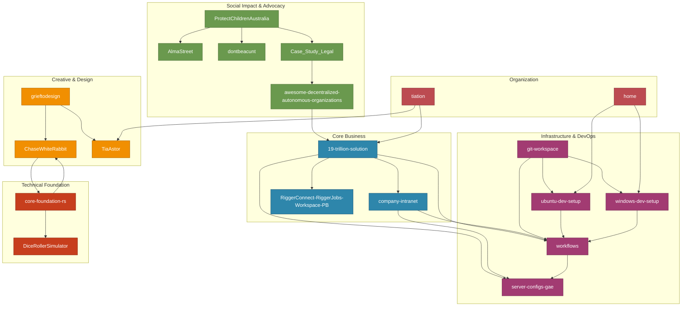

# Tiation Repository Dependency Graph

This visual representation shows how all repositories in the Tiation GitHub ecosystem are interconnected.

## Repository Relationship Diagram

## Dependency Matrix

| Repository | Direct Dependencies | Dependent Repositories |
|------------|-------------------|----------------------|
| **19-trillion-solution** | company-intranet, RiggerConnect, server-configs-gae, workflows | awesome-decentralized-autonomous-organizations, tiation |
| **company-intranet** | 19-trillion-solution, workflows, server-configs-gae | - |
| **RiggerConnect-RiggerJobs-Workspace-PB** | 19-trillion-solution | - |
| **server-configs-gae** | workflows | 19-trillion-solution, company-intranet |
| **workflows** | server-configs-gae | All repositories (CI/CD) |
| **git-workspace** | ubuntu-dev-setup, windows-dev-setup, workflows | - |
| **ubuntu-dev-setup** | git-workspace, workflows, server-configs-gae | home |
| **windows-dev-setup** | git-workspace, workflows, server-configs-gae | home |
| **grieftodesign** | TiaAstor, ChaseWhiteRabbit | - |
| **ChaseWhiteRabbit** | grieftodesign, core-foundation-rs | - |
| **TiaAstor** | grieftodesign, tiation | - |
| **core-foundation-rs** | - | DiceRollerSimulator, ChaseWhiteRabbit |
| **DiceRollerSimulator** | core-foundation-rs | - |
| **ProtectChildrenAustralia** | Case_Study_Legal, AlmaStreet, dontbeacunt | - |
| **AlmaStreet** | ProtectChildrenAustralia | - |
| **dontbeacunt** | ProtectChildrenAustralia | - |
| **Case_Study_Legal** | ProtectChildrenAustralia, awesome-decentralized-autonomous-organizations | - |
| **awesome-decentralized-autonomous-organizations** | Case_Study_Legal, 19-trillion-solution | - |
| **tiation** | TiaAstor, 19-trillion-solution | All repositories (parent org) |
| **home** | ubuntu-dev-setup, windows-dev-setup | - |

## Integration Points

### CI/CD Integration
All repositories integrate with the `workflows` repository for continuous integration and deployment:
- Build automation
- Test execution
- Deployment pipelines
- Security scanning

### Infrastructure Integration
Deployed projects integrate with `server-configs-gae`:
- 19-trillion-solution
- company-intranet
- ProtectChildrenAustralia (if deployed)

### Development Environment Integration
All development projects can utilize:
- ubuntu-dev-setup
- windows-dev-setup
- git-workspace

### Legal & Compliance Integration
Projects requiring legal frameworks integrate with:
- Case_Study_Legal
- awesome-decentralized-autonomous-organizations (for DAO structures)

## Repository Categories

### 🏢 Enterprise Solutions
- 19-trillion-solution (flagship)
- company-intranet
- RiggerConnect-RiggerJobs-Workspace-PB

### 🛠 Development Infrastructure
- server-configs-gae
- workflows
- git-workspace
- ubuntu-dev-setup
- windows-dev-setup

### 🎨 Creative Projects
- grieftodesign
- ChaseWhiteRabbit
- TiaAstor

### 🔧 Technical Libraries
- core-foundation-rs
- DiceRollerSimulator

### 🏛 Social Impact
- ProtectChildrenAustralia
- AlmaStreet
- dontbeacunt
- Case_Study_Legal
- awesome-decentralized-autonomous-organizations

### 🏠 Organization & Personal
- tiation
- home

---

*This diagram is automatically generated based on repository relationships defined in [REPOSITORY_INDEX.md](./REPOSITORY_INDEX.md)*
